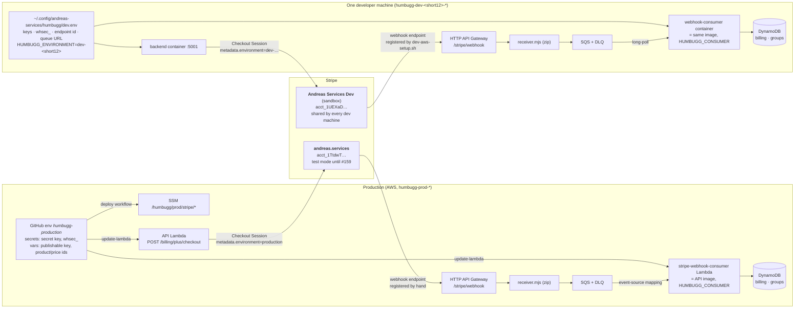
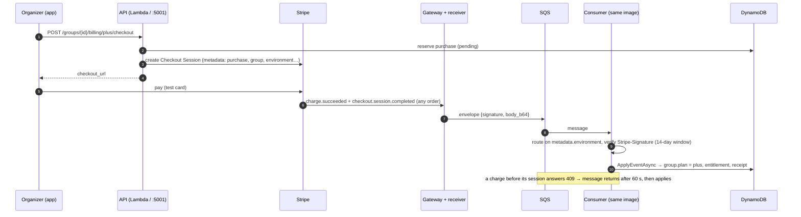

# Humbugg Stripe Setup & Runbook (Test Mode)

This runbook establishes a **test-mode-only** billing foundation for Humbugg. It
covers creating the Stripe test account, creating the Plus and Work test
products/prices, where every ID and secret is stored, the rotation procedure,
ownership, and the gate that keeps live mode disabled.

> **Live mode is BLOCKED.** Real payments are not accepted. Live-mode activation
> is gated behind the merchant-identity / legal-entity review tracked in
> **issue #159**. The backend refuses any live-mode key or `HUMBUGG_STRIPE_MODE=live`
> at startup, and the Terraform billing module only ever stores test-mode values.

Issue **#123** established the configuration surface and secure wiring. Issue
**#139** adds Checkout Session creation, signature-verified webhook processing,
the idempotent payment ledger, and per-exchange Plus entitlement writes.

## 0. How it is wired

Two Stripe accounts, one Humbugg code path.



**Why two accounts.** Stripe fans every event out to every webhook endpoint in
an account. Production is test-mode until #159, so if dev endpoints sat in
production's account they would receive real users' Checkout payloads (names,
emails). Dev machines share one sandbox instead; production has its own account.
Once #159 puts production in live mode the boundary is Stripe's own — a live
event cannot reach a test endpoint — and the sandbox is simply dev's.

**Why the queue, everywhere.** Stripe cannot reach `localhost:5001`, so a dev
machine needs a public URL; the Stripe CLI's `stripe listen` relay used to
provide one and lost every event emitted while it was not running. The relay
(`infra/modules/webhook_relay`: gateway → dependency-free receiver → SQS) gives
each environment a durable public endpoint. Production takes the same path so
the code a developer watches close a purchase is the code that closes one in
production — and inherits the durability: an event behind a failed deploy waits
in the queue, not in Stripe's retry schedule.

**One consumer, two hosts.** The consumer is the API's own container image
entered through `ConsumerHost` (`HUMBUGG_CONSUMER=stripe-webhooks`,
`backend/Humbugg.Api/Consumers/StripeWebhooks/`). In production it is a Lambda on
an SQS event-source mapping; on a developer's machine it is the
`webhook-consumer` service in `backend/docker-compose.yml`, long-polling that
machine's queue. Both call `IBillingService.ProcessQueuedWebhookAsync` — the
HTTP route's processing with the queue's 14-day retention as the signature
timestamp window instead of Stripe's five minutes. The API's
`/api/billing/stripe/webhook` route still exists; Stripe is no longer told about
it.

**Routing inside the shared sandbox.** Every dev machine's endpoint receives
every dev machine's events. The backend stamps `HUMBUGG_ENVIRONMENT`
(`dev-<short12>`, generated by `dev-aws-setup.sh`) into each Checkout's
metadata; a consumer applies only events carrying its own value and consumes
the rest with a log line. In production the value is `production` and the check
is free.

What one purchase looks like:



Where each value lives is §3; the dev-machine procedure is §4.

---

## 1. Create the Stripe test account

> TODO (owner action — cannot be automated in this repo): a human with the
> Humbugg billing owner account must perform these steps in the Stripe Dashboard.

1. Create (or reuse) the Humbugg Stripe account. Keep the account toggle in
   **Test mode** (top-right of the Dashboard) for every step below.
2. Do **not** submit business/merchant-identity details yet — that is part of
   issue #159 and would begin live-mode activation, which is out of scope.
3. No real bank account or card is required to operate in test mode.

## 2. Create the test products and prices

Create two products with a single price each. The amounts mirror the backend
plan defaults (`HUMBUGG_PLUS_PRICE_CENTS=1200`, `HUMBUGG_WORK_PRICE_CENTS=9900`).

| Product | Price | Billing | Resulting IDs |
|---|---|---|---|
| **Humbugg Plus** | $12.00 USD | One-time | `prod_...` (Plus product), `price_...` (Plus price) |
| **Humbugg Work** (deferred — #638; not served while `HUMBUGG_WORK_ENABLED` is unset) | $99.00 USD / year | Recurring (annual) | `prod_...` (Work product), `price_...` (Work price) |

> TODO (owner action): create these in **Test mode** and copy the four IDs. All
> four are **test-mode** IDs (`prod_...` / `price_...`, from a test account).

For Plus, the repository provides an idempotent provisioning command. After
authenticating the Stripe CLI against the Humbugg test account, run:

```bash
./humbugg/scripts/configure-stripe-plus.sh              # test mode (default)
./humbugg/scripts/configure-stripe-plus.sh --mode live   # do not run — #159 still blocks live mode
```

It reuses a tagged Plus product and active `$12 USD` one-time price when they
already exist, creates only missing resources, verifies the resulting price
(`livemode == false` in test mode, `== true` in `--mode live`), and prints the two
GitHub environment variable assignments. It never accepts or stores a secret key.
`configure-stripe-plus-test.sh` still works — it execs this script with `--mode test`.

### Register the production test webhook

In the Stripe Dashboard while **Viewing test data**, create an endpoint for:

```text
https://api.humbugg.com/api/billing/stripe/webhook
```

Not `humbugg.com` — that is the marketing CloudFront and answers 403. The route lives on
the API's own domain (`infra/modules/compute/main.tf`, the `stripe_webhook` route).

Subscribe only to:

- `checkout.session.completed`
- `checkout.session.async_payment_succeeded`
- `checkout.session.async_payment_failed`
- `checkout.session.expired`
- `charge.succeeded`
- `charge.refunded`

Copy that endpoint's `whsec_...` value into the GitHub environment secret
`HUMBUGG_STRIPE_WEBHOOK_SECRET`. A dev machine has its own endpoint and its own
secret, registered by `dev-aws-setup.sh` (section 4).

**The URL is the webhook relay's gateway, not the API's route.** Since the relay
(`infra/modules/webhook_relay`) prod's Stripe endpoint points at
`terraform output webhook_endpoint_url` of `envs/prod` — an `execute-api`
hostname ending in `/stripe/webhook`. Stripe → gateway → receiver → SQS → the
`humbugg-prod-stripe-webhook-consumer` Lambda (the API image, entered through
`ConsumerHost`). The API's `/api/billing/stripe/webhook` route still exists and
still verifies; it is no longer what Stripe is told about.

Product and price IDs are **configuration, not code** — the backend
`PlanCatalog` reads them from environment variables (see the mapping below), and
`StripeSettings` reads the keys. Nothing is hardcoded.

## 3. Where each value lives

Everything flows from the `humbugg-production` GitHub Actions environment. The
deploy workflow (`.github/workflows/humbugg-prod.yaml`) injects them; nothing is
committed to the repo.

`HUMBUGG_STRIPE_MODE` is an operator toggle, not a build-time choice: `disabled`
(billing dormant — today's prod state, #640), `test` (test keys, Stripe test cards,
no money ever moves), `live` (blocked until the merchant-identity review in #159
closes). Moving between them is a GitHub environment variable change plus a redeploy —
see the rotation procedure below.

### Secrets — GitHub environment **secrets** → SSM (SecureString) + Lambda env

| Value | GitHub secret | SSM parameter (Terraform-managed) | Lambda env var |
|---|---|---|---|
| Secret key (`sk_test_...`) | `HUMBUGG_STRIPE_SECRET_KEY` | `/humbugg/prod/stripe/secret-key` (SecureString) | `HUMBUGG_STRIPE_SECRET_KEY` |
| Webhook signing secret (`whsec_...`) | `HUMBUGG_STRIPE_WEBHOOK_SECRET` | `/humbugg/prod/stripe/webhook-secret` (SecureString) | `HUMBUGG_STRIPE_WEBHOOK_SECRET` |

The `billing` Terraform module (`humbugg/infra/modules/billing`) declares these
SSM parameters. Values arrive via `TF_VAR_stripe_secret_key` /
`TF_VAR_stripe_webhook_secret` in the `deploy-infra` job. Until the secrets are
set the parameters are **not created** (the module uses `count`), so the stack
stays deployable before the Stripe account exists.

### Non-secret config — GitHub environment **vars** → Lambda env

| Value | GitHub var | Lambda env var |
|---|---|---|
| Mode (`test` / `disabled`) | `HUMBUGG_STRIPE_MODE` | `HUMBUGG_STRIPE_MODE` |
| Publishable key (`pk_test_...`) | `HUMBUGG_STRIPE_PUBLISHABLE_KEY` | `HUMBUGG_STRIPE_PUBLISHABLE_KEY` |
| Plus product ID | `HUMBUGG_PLUS_PRODUCT_ID` | `HUMBUGG_PLUS_PRODUCT_ID` |
| Plus price ID | `HUMBUGG_PLUS_PRICE_ID` | `HUMBUGG_PLUS_PRICE_ID` |
| Work product ID (deferred — #638; not served while `HUMBUGG_WORK_ENABLED` is unset) | `HUMBUGG_WORK_PRODUCT_ID` | `HUMBUGG_WORK_PRODUCT_ID` |
| Work price ID (deferred — #638; not served while `HUMBUGG_WORK_ENABLED` is unset) | `HUMBUGG_WORK_PRICE_ID` | `HUMBUGG_WORK_PRICE_ID` |

The publishable key is also mirrored into `/humbugg/prod/stripe/publishable-key`
(SSM `String`) by the billing module for discoverability.

> Leave `HUMBUGG_STRIPE_MODE` unset or `disabled` until the secrets and product
> IDs are all provisioned. Setting it to `test` without the required credentials
> makes the backend **fail fast at startup** — that is intentional.

## 4. Local development (test mode + fixtures)

No live key, real card, or payment method is ever required.

1. Your env file is `~/.config/andreas-services/humbugg/dev.env` (written by
   `dev-aws-setup.sh`; `humbugg/dev.env.sample` documents every key).
2. To run **without** Stripe, keep `HUMBUGG_STRIPE_MODE=disabled` (default).
3. To exercise billing locally, put the **`humbugg-dev` sandbox's** keys into
   `dev.env` and re-run setup:
   ```
   HUMBUGG_STRIPE_MODE=test
   HUMBUGG_STRIPE_PUBLISHABLE_KEY=pk_test_...   # Dashboard → humbugg-dev sandbox
   HUMBUGG_STRIPE_SECRET_KEY=sk_test_...
   ```
   ```bash
   ./humbugg/scripts/dev-aws-setup.sh
   ```
   Setup registers this machine's own webhook endpoint with Stripe — the public
   URL of the relay `infra/modules/webhook_relay` applied for it — and writes
   `HUMBUGG_STRIPE_WEBHOOK_ENDPOINT_ID` and that endpoint's `whsec_...` into
   `dev.env`. Nothing is copied by hand. The consumer that drains the relay's
   queue is the backend image's `webhook-consumer` Compose service, started with
   the API by `dev-up-backend.sh`. `dev-aws-destroy.sh` deletes the endpoint
   again.

   **A separate sandbox, not the one production charges against.** Stripe fans
   every event out to every endpoint in a sandbox, and production is test-mode
   until #159 — so a dev endpoint in production's sandbox would receive real
   users' Checkout payloads (names, emails). Sandboxes are isolated; a
   `humbugg-dev` one sees only dev machines. Once production goes live, live
   events cannot reach a test endpoint by construction, and the old sandbox
   is simply a sandbox.

   Two developers share the dev sandbox. Each machine's backend stamps
   `HUMBUGG_ENVIRONMENT` (`dev-<short12>`, generated by setup) into every
   Checkout's metadata, and each consumer forwards only events carrying its own.

   The Stripe CLI is still needed — setup uses it to register the endpoint, and
   `dev-aws-seed.sh` uses it to complete a test Checkout — but no `stripe login`
   is: both point it at `HUMBUGG_STRIPE_SECRET_KEY` for the call.
4. Use Stripe's [test cards](https://stripe.com/docs/testing) (e.g. `4242 4242 4242 4242`)
   and `stripe trigger` fixtures for events. The backend's `StripeSettings`
   validation rejects any `sk_live_` / `pk_live_` / `rk_live_` credential, so a
   live key cannot be used by accident.

Both Checkout return URLs are `{APP_BASE_URL}/organize/<group-id>?checkout=…` — the
organizer's billing area in the product app. Locally that is
`http://localhost:8081/organize/<group-id>`, and Stripe permits HTTP only for localhost
testing, so `APP_BASE_URL` must name the **app** origin (`:8081`), not the marketing
site. The path used to be `/app/groups/<id>`, which dates from the app being served under
`www.humbugg.com/app`: only the marketing origin still 301s that shape, so once
`APP_BASE_URL` became `app.humbugg.com` every paid return landed on the not-found screen.

The billing area polls the signed-in purchase status after a successful return and waits
for the **entitlement**, not for `status: paid`. The webhook writes the entitlement and the
group's plan in one transaction and `PlanCatalog.HasCapability` reads the entitlement, so a
paid row without one is a purchase Stripe has taken money for and Humbugg has not applied —
the screen says exactly that instead of promising a capability the next request would 402.

On native there is no return URL at all: an `https://` success URL cannot re-enter the app,
so Checkout is opened in the system browser and closing it is the signal to re-read the
purchase. The API is the source of truth on both platforms; the `?checkout=` query is only
a hint about what Stripe told the browser.

## 5. Rotation procedure

Rotate on a schedule and immediately on any suspected exposure.

1. **Secret key** — in the Stripe Dashboard (test mode) → Developers → API keys →
   *Roll* the secret key. Update the GitHub secret `HUMBUGG_STRIPE_SECRET_KEY`,
   then re-run the `humbugg-prod` deploy (`workflow_dispatch`, `run_infra=true`)
   so Terraform rewrites `/humbugg/prod/stripe/secret-key` and `update-lambda`
   refreshes the Lambda env. Revoke the old key once the deploy is green.
2. **Webhook secret** — roll the endpoint's signing secret in the Dashboard,
   update `HUMBUGG_STRIPE_WEBHOOK_SECRET`, and redeploy as above.
3. **Publishable key** — rarely rotated (not secret); update
   `HUMBUGG_STRIPE_PUBLISHABLE_KEY` var and redeploy if it changes.
4. Never edit the SSM SecureString values by hand — always go through GitHub
   secrets + the deploy pipeline to avoid IaC drift.

## 6. Ownership

- **Billing / Stripe account owner:** the repo owner — owns the Stripe account,
  product catalog, and key rotation. The address is in the Stripe dashboard and
  is deliberately not recorded here; this repo is public.
- **Infra / secret wiring:** whoever owns the `humbugg-production` GitHub
  environment and the Humbugg Terraform state.
- Changes to products, prices, or keys must be reflected in the GitHub
  environment values above — not in application code.

## 7. Live-mode gate (do not remove)

Live mode stays disabled until issue **#159** (merchant-identity / legal-entity
review) is complete and explicitly signed off. Enforcement points:

- `StripeSettings.ParseMode` throws on `HUMBUGG_STRIPE_MODE=live`.
- `StripeSettings.Validate` throws on any `sk_live_` / `pk_live_` / `rk_live_`
  credential, in every mode.
- The Terraform `billing` module only ever stores the test-mode values passed in.

Activating live mode is a deliberate, reviewed follow-up — not a config toggle.
